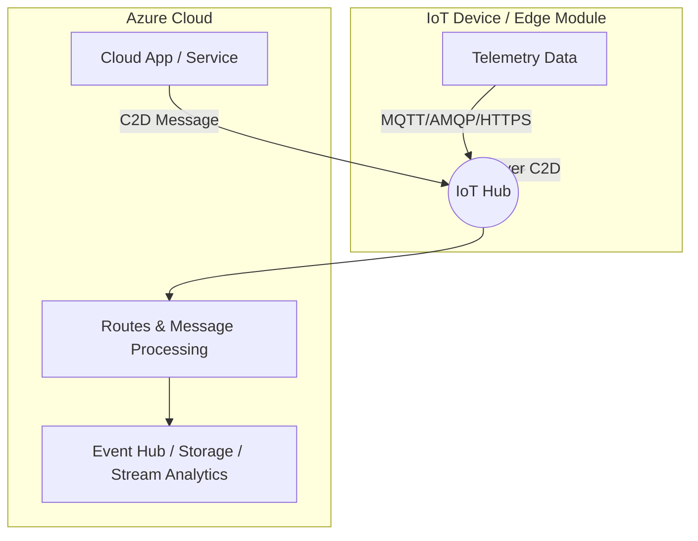

# IoT Edge and IoT Hub Communication Summary

## Key Points
- **Azure IoT Hub** acts as a **cloud-based message broker**.
- IoT devices (or IoT Edge devices) communicate with IoT Hub using **MQTT, AMQP, or HTTPS** protocols.
- **MQTT** is commonly used due to its lightweight nature, ideal for constrained devices.
- IoT Hub handles:
  - **Device-to-Cloud (D2C) messages** – telemetry sent by devices.
  - **Cloud-to-Device (C2D) messages** – commands or configurations from the cloud.
- Devices do **not publish to arbitrary MQTT topics** like in a standard broker. Instead:
  - Device sends telemetry to **IoT Hub endpoints** (D2C).
  - IoT Hub routes messages internally (to Event Hub, storage, Stream Analytics, etc.).
  - Cloud applications send **C2D messages** via IoT Hub to the device.
- IoT Edge extends this by allowing modules to run locally on edge devices and communicate with IoT Hub.

---

## Communication Flow (Mermaid Diagram)

---

## Summary
- IoT Hub is a **message broker** between IoT devices and the cloud.
- Devices send telemetry (**D2C**) and receive commands (**C2D**) via IoT Hub.
- IoT Edge modules extend device capability by running workloads locally while still leveraging IoT Hub for cloud connectivity.
